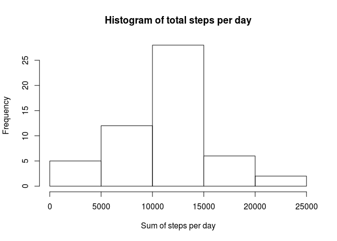
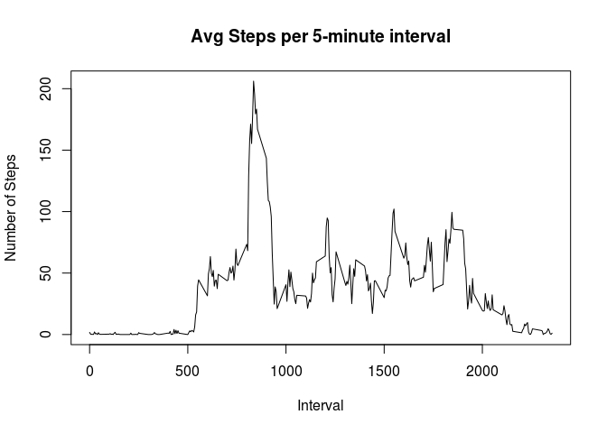

# Reproducible Research: Peer Assessment 1

## Loading and preprocessing the data

```r
data <- read.csv('activity.csv')
```
## What is mean total number of steps taken per day?


```r
filtered <- data[!is.na(data$steps),]
x <- aggregate(filtered$steps ~ filtered$date,filtered,sum)
names(x) <- c('date', 'sum_steps')
mean(x$sum_steps)
```

```
## [1] 10766.19
```

```r
median(x$sum_steps)
```

```
## [1] 10765
```


```r
hist(x$sum_steps, main = "Histogram of total steps per day", xlab = "Sum of steps per day")
```

 

## What is the average daily activity pattern?

```r
intervalData <- aggregate(data[1], by=data[3], FUN=mean, na.rm=TRUE)
plot(x=intervalData$interval,y=intervalData$steps,type="l",main="Avg Steps per 5-minute interval",xlab="Interval", ylab="Number of Steps")
```

 

```r
intervalData$interval[which.max(intervalData$steps)]
```

```
## [1] 835
```

## Inputing missing values

```r
missing <- data[is.na(data$steps),]
nrow(missing)
```

```
## [1] 2304
```


## Are there differences in activity patterns between weekdays and weekends?
